# 🔥 每日远程职位精选

  

  <strong><a href="https://www.remotejobscan.com">RemoteJobScan.com</a></strong> &nbsp;·&nbsp; <a href="README_EN.md">📖 English</a>

  <strong>实时更新 AI、Web3、区块链、加密货币领域最新远程职位。</strong> 
  <strong>所有职位直接来自公司官网。</strong>

  📊 已收录 <strong>48</strong> 家公司 · <strong>3024</strong> 个远程职位 · 每 30 分钟更新

---

## 🆕 今日更新（20 个精选职位）

| 职位 | 地点 | 详情 |
|---|---|---|
| 客户成功经理 | 实地 | [查看详情 →](https://www.remotejobscan.com/job/17888/customer-success-manager/) |
| 软件工程实习生 - 冬季'27 | 远程/实地 | [查看详情 →](https://www.remotejobscan.com/job/15779/software-engineering-intern-winter-27/) |
| 软件工程实习生 - 2027年夏季 | 远程/实地 | [查看详情 →](https://www.remotejobscan.com/job/15778/software-engineering-intern-summer-27/) |
| 高级软件工程师，AI计算，Together Cloud | 实地 | [查看详情 →](https://www.remotejobscan.com/job/9863/staff-software-engineer-ai-compute-together-cloud/) |
| 影响力制作人 | 实地 | [查看详情 →](https://www.remotejobscan.com/job/17875/impact-producer/) |
| 软件工程实习生 – 2027年冬季（美国基地） | 远程/实地 | [查看详情 →](https://www.remotejobscan.com/job/17889/software-engineering-intern-winter-2027-us-based/) |
| 物理工程业务主管（特殊情况） | 远程/实地 | [查看详情 →](https://www.remotejobscan.com/job/17380/physical-engineering-business-lead-special-situations/) |
| 拉美产品合作负责人 | 远程/实地 | [查看详情 →](https://www.remotejobscan.com/job/17886/head-of-latam-product-partnerships/) |
| 高级运营助理 | 远程 | [查看详情 →](https://www.remotejobscan.com/job/17844/prime-operations-assistant/) |
| 技术团队成员（搜索爬虫分析师） | 远程/实地 | [查看详情 →](https://www.remotejobscan.com/job/17887/member-of-technical-staff-search-crawler-analyst/) |
| 企业客户经理 | 远程/实地 | [查看详情 →](https://www.remotejobscan.com/job/17885/enterprise-account-executive/) |
| 企业客户经理 - 金融服务业 | 远程 | [查看详情 →](https://www.remotejobscan.com/job/17884/enterprise-account-executive-financial-services/) |
| 实验室资深软件安全工程师 | 实地 | [查看详情 →](https://www.remotejobscan.com/job/17695/staff-software-security-engineer-labs/) |
| 数字证券与市场结构政策高级经理 | 远程 | [查看详情 →](https://www.remotejobscan.com/job/17840/senior-manager-digital-securities-market-structure-policy/) |
| 高级分析工程师，GFCO分析团队 | 远程 | [查看详情 →](https://www.remotejobscan.com/job/9191/senior-analytics-engineer-gfco-analytics/) |
| 质量保证主管 | 远程 | [查看详情 →](https://www.remotejobscan.com/job/17883/qa-lead/) |
| 投诉分析师III | 远程/实地 | [查看详情 →](https://www.remotejobscan.com/job/17159/complaints-analyst-iii/) |
| 营销合规负责人 | 远程 | [查看详情 →](https://www.remotejobscan.com/job/17880/head-of-marketing-compliance/) |
| 非英文模板 | 实地 | [查看详情 →](https://www.remotejobscan.com/job/17882/non-eng-template/) |
| 隐私顾问 | 实地 | [查看详情 →](https://www.remotejobscan.com/job/17881/privacy-counsel/) |
[📋 查看全部职位 →](https://www.remotejobscan.com)

---

## 🏢 已收录公司（48 家）

| 公司 | 官网 | 职位 |
|---|---|---|
|  | <a href="https://1inch.com/">1inch</a> | [查看职位 →](https://www.remotejobscan.com/?company=1inch) |
|  | <a href="https://aave.com/">Aave</a> | [查看职位 →](https://www.remotejobscan.com/?company=aave) |
| 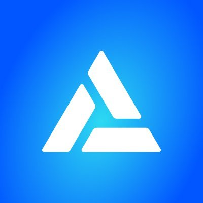 | <a href="https://www.alchemy.com/">Alchemy</a> | [查看职位 →](https://www.remotejobscan.com/?company=alchemy) |
|  | <a href="https://www.anthropic.com/">Anthropic</a> | [查看职位 →](https://www.remotejobscan.com/?company=anthropic) |
|  | <a href="https://aptoslabs.com/">Aptos Labs</a> | [查看职位 →](https://www.remotejobscan.com/?company=aptos-labs) |
|  | <a href="https://asterdex.com">Aster</a> | [查看职位 →](https://www.remotejobscan.com/?company=aster) |
|  | <a href="https://www.binance.com">Binance</a> | [查看职位 →](https://www.remotejobscan.com/?company=binance) |
|  | <a href="https://www.bitget.com/">Bitget</a> | [查看职位 →](https://www.remotejobscan.com/?company=bitget) |
| 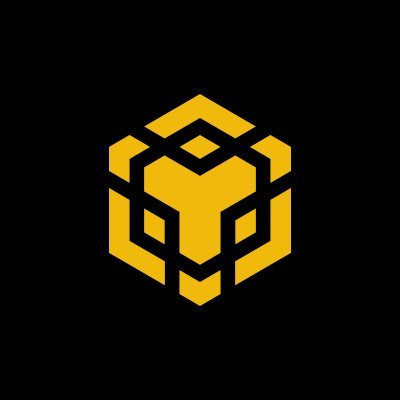 | <a href="https://www.bnbchain.org">BNB Chain</a> | [查看职位 →](https://www.remotejobscan.com/?company=bnb-chain) |
|  | <a href="https://bybitglobal.com/">Bybit</a> | [查看职位 →](https://www.remotejobscan.com/?company=bybit) |
|  | <a href="https://www.certik.com/">CertiK</a> | [查看职位 →](https://www.remotejobscan.com/?company=certik) |
|  | <a href="https://www.circle.com/">Circle</a> | [查看职位 →](https://www.remotejobscan.com/?company=circle) |
|  | <a href="https://cohere.com/">Cohere</a> | [查看职位 →](https://www.remotejobscan.com/?company=cohere) |
|  | <a href="https://www.coinbase.com/">Coinbase</a> | [查看职位 →](https://www.remotejobscan.com/?company=coinbase) |
|  | <a href="https://www.coinex.com">CoinEx</a> | [查看职位 →](https://www.remotejobscan.com/?company=coinex) |
|  | <a href="https://coinmarketcap.com">CoinMarketCap</a> | [查看职位 →](https://www.remotejobscan.com/?company=coinmarketcap) |
|  | <a href="https://www.coins.ph">coins.ph</a> | [查看职位 →](https://www.remotejobscan.com/?company=coins-ph) |
|  | <a href="https://crypto.com/">crypto.com</a> | [查看职位 →](https://www.remotejobscan.com/?company=crypto-com) |
| 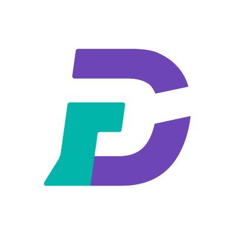 | <a href="https://www.digifinex.com">DigiFinex</a> | [查看职位 →](https://www.remotejobscan.com/?company=digifinex) |
|  | <a href="https://elevenlabs.io/">ElevenLabs</a> | [查看职位 →](https://www.remotejobscan.com/?company=elevenlabs) |
|  | <a href="https://www.gate.com/">Gate</a> | [查看职位 →](https://www.remotejobscan.com/?company=gate) |
|  | <a href="https://www.gauntlet.xyz/">Gauntlet</a> | [查看职位 →](https://www.remotejobscan.com/?company=gauntlet) |
|  | <a href="https://www.gemini.com/">Gemini</a> | [查看职位 →](https://www.remotejobscan.com/?company=gemini) |
|  | <a href="https://hyperfoundation.org/">Hyperliquid</a> | [查看职位 →](https://www.remotejobscan.com/?company=hyperliquid) |
|  | <a href="https://www.kraken.com/">Kraken</a> | [查看职位 →](https://www.remotejobscan.com/?company=kraken) |
|  | <a href="https://www.kucoin.com/">KuCoin</a> | [查看职位 →](https://www.remotejobscan.com/?company=kucoin) |
|  | <a href="https://www.langchain.com/">LangChain</a> | [查看职位 →](https://www.remotejobscan.com/?company=langchain) |
|  | <a href="https://layerzero.network">LayerZero</a> | [查看职位 →](https://www.remotejobscan.com/?company=layerzero) |
|  | <a href="https://www.lbank.com/">Lbank</a> | [查看职位 →](https://www.remotejobscan.com/?company=lbank) |
|  | <a href="https://lista.org">Lista DAO</a> | [查看职位 →](https://www.remotejobscan.com/?company=lista-dao) |
|  | <a href="https://www.offchainlabs.com/">OffchainLabs</a> | [查看职位 →](https://www.remotejobscan.com/?company=offchainlabs) |
|  | <a href="http://okx.com/">OKX</a> | [查看职位 →](https://www.remotejobscan.com/?company=okx) |
|  | <a href="https://www.optimism.io/">OP Labs</a> | [查看职位 →](https://www.remotejobscan.com/?company=op-labs) |
| 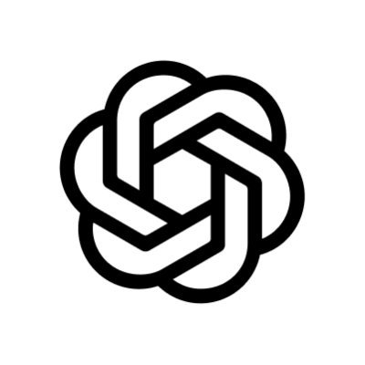 | <a href="https://openai.com/">OpenAI</a> | [查看职位 →](https://www.remotejobscan.com/?company=openai) |
| 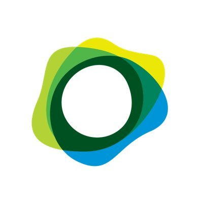 | <a href="https://www.paxos.com">PAXOS</a> | [查看职位 →](https://www.remotejobscan.com/?company=paxos) |
| 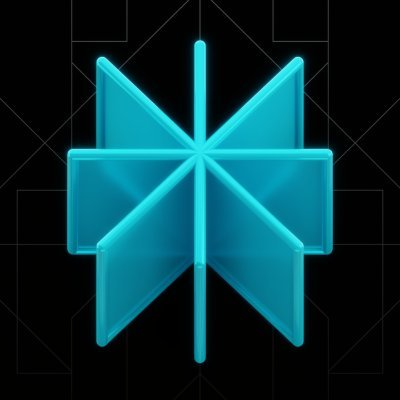 | <a href="https://www.perplexity.ai/">Perplexity</a> | [查看职位 →](https://www.remotejobscan.com/?company=perplexity) |
|  | <a href="https://phantom.com/">Phantom</a> | [查看职位 →](https://www.remotejobscan.com/?company=phantom) |
| 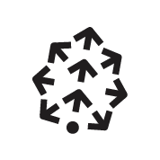 | <a href="https://www.pinecone.io/">Pinecone</a> | [查看职位 →](https://www.remotejobscan.com/?company=pinecone) |
|  | <a href="https://predict.fun">Predict</a> | [查看职位 →](https://www.remotejobscan.com/?company=predict) |
| 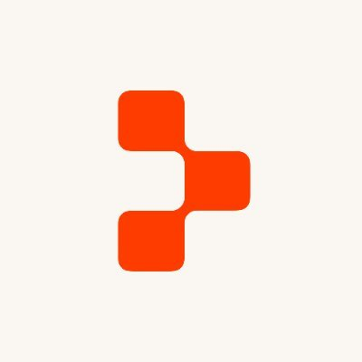 | <a href="https://replit.com/">Replit</a> | [查看职位 →](https://www.remotejobscan.com/?company=replit) |
|  | <a href="https://solana.org/">Solana Foundation</a> | [查看职位 →](https://www.remotejobscan.com/?company=solana-foundation) |
|  | <a href="https://www.sui.io">Sui</a> | [查看职位 →](https://www.remotejobscan.com/?company=sui) |
| 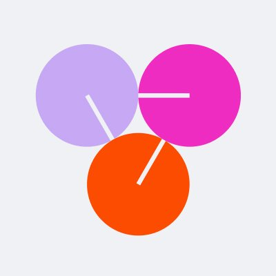 | <a href="https://www.together.ai/">Together AI</a> | [查看职位 →](https://www.remotejobscan.com/?company=together-ai) |
| 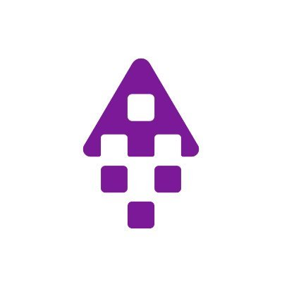 | <a href="https://tothemoon.com/">Tothemoon</a> | [查看职位 →](https://www.remotejobscan.com/?company=tothemoon) |
| 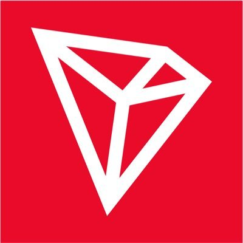 | <a href="https://tron.network">TRON</a> | [查看职位 →](https://www.remotejobscan.com/?company=tron) |
| 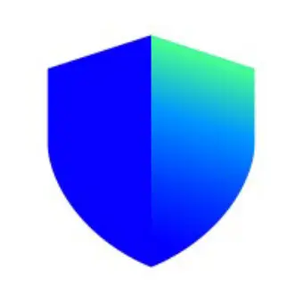 | <a href="https://trustwallet.com">Trust Wallet</a> | [查看职位 →](https://www.remotejobscan.com/?company=trust-wallet) |
|  | <a href="https://u.tech">United Stables</a> | [查看职位 →](https://www.remotejobscan.com/?company=united-stables) |
|  | <a href="https://vercel.com/">Vercel</a> | [查看职位 →](https://www.remotejobscan.com/?company=vercel) |

---

---

  由 <a href="https://www.remotejobscan.com">RemoteJobScan</a> 维护 · 2026-10-08 19:00 UTC 
  ⭐ 如果这个仓库对你有用，欢迎 star 支持

