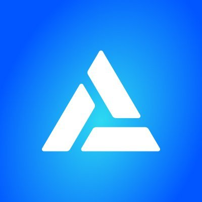
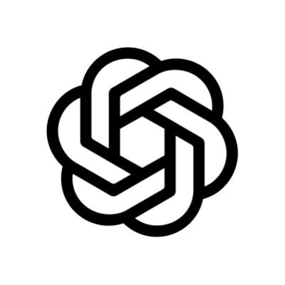
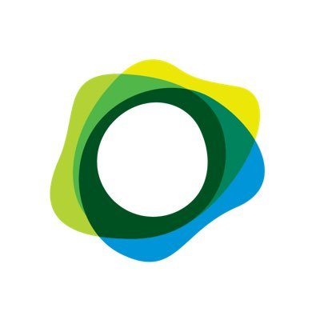
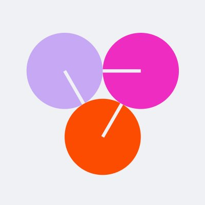
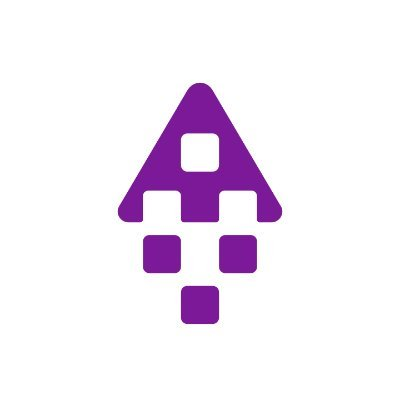
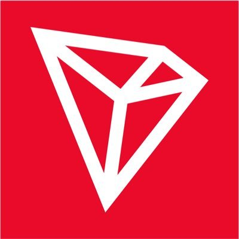
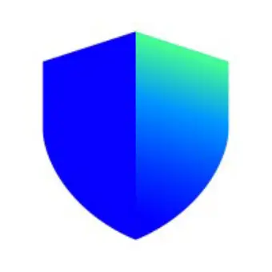

# 🔥 每日远程职位精选

  

  <strong><a href="https://www.remotejobscan.com">RemoteJobScan.com</a></strong> &nbsp;·&nbsp; <a href="README_EN.md">📖 English</a>

  <strong>实时更新 AI、Web3、区块链、加密货币领域最新远程职位。</strong> 
  <strong>所有职位直接来自公司官网。</strong>

  📊 已收录 <strong>50</strong> 家公司 · <strong>3319</strong> 个远程职位 · 每 30 分钟更新

---

## 🆕 今日更新（20 个精选职位）

| 职位 | 地点 | 详情 |
|---|---|---|
| 纽约办公体验 | 实地 | [查看详情 →](https://www.remotejobscan.com/job/20353/workplace-experience-new-york/) |
| 高级软件工程师 - 前端 - 开发平台 | 远程 | [查看详情 →](https://www.remotejobscan.com/job/20351/senior-software-engineer-frontend-developer-platform/) |
| 公司运营负责人 | 远程 | [查看详情 →](https://www.remotejobscan.com/job/20352/company-operations-lead/) |
| 财务转型总监 | 远程 | [查看详情 →](https://www.remotejobscan.com/job/19936/finance-transformation-director/) |
| OEM - 高级合规分析师 | 实地 | [查看详情 →](https://www.remotejobscan.com/job/16441/oem-senior-compliance-analyst/) |
| TRUST网络高级软件工程师 | 远程 | [查看详情 →](https://www.remotejobscan.com/job/19816/staff-software-engineer-trust-network/) |
| 高级软件工程师，TRUST网络 | 远程 | [查看详情 →](https://www.remotejobscan.com/job/19875/senior-software-engineer-trust-network/) |
| Senior Development Engineer - Compliance Platform 高级开发工程师-合规平台 | 远程 | [查看详情 →](https://www.remotejobscan.com/job/20336/senior-development-engineer-compliance-platform/) |
| Wallet Operations (Singapore) 钱包运营（新加坡） | 远程 | [查看详情 →](https://www.remotejobscan.com/job/19715/wallet-operations-singapore/) |
| Financial Product Manager 金融产品经理（传统金融资讯、行情方向） | 远程 | [查看详情 →](https://www.remotejobscan.com/job/16188/financial-product-manager/) |
| 本地化平台与质量高级产品经理 | 实地 | [查看详情 →](https://www.remotejobscan.com/job/20346/senior-product-manager-localization-platform-and-quality/) |
| AI与Web3钱包首席/高级产品经理 | 实地 | [查看详情 →](https://www.remotejobscan.com/job/11454/principalsenior-product-manager-ai-web3-wallet/) |
| 内部控制与测试分析师（保加利亚） | 远程/实地 | [查看详情 →](https://www.remotejobscan.com/job/20345/internal-controls-and-testing-analyst-bulgaria/) |
| Global VIP Growth Associate (VIP增长专员) | 实地 | [查看详情 →](https://www.remotejobscan.com/job/20344/global-vip-growth-associate-vip/) |
| 高级前端开发 Senior Frontend Developer | 远程 | [查看详情 →](https://www.remotejobscan.com/job/19682/senior-frontend-developer/) |
| Senior Application Security Engineer 高级应用安全工程师 | 远程 | [查看详情 →](https://www.remotejobscan.com/job/20343/senior-application-security-engineer/) |
| Java Architect java架构师（中间件，基础架构） | 远程 | [查看详情 →](https://www.remotejobscan.com/job/20338/java-architect-java/) |
| Senior Java Engineer 高级Java工程师-监管数据治理方向 | 远程 | [查看详情 →](https://www.remotejobscan.com/job/20339/senior-java-engineer-java/) |
| Java Engineer java工程师-合规站点交付方向 | 远程 | [查看详情 →](https://www.remotejobscan.com/job/20340/java-engineer-java/) |
[📋 查看全部职位 →](https://www.remotejobscan.com)

---

## 🏢 已收录公司（50 家）

| 公司 | 官网 | 职位 |
|---|---|---|
|  | <a href="https://1inch.com/">1inch</a> | [查看职位 →](https://www.remotejobscan.com/?company=1inch) |
|  | <a href="https://aave.com/">Aave</a> | [查看职位 →](https://www.remotejobscan.com/?company=aave) |
|  | <a href="https://www.alchemy.com/">Alchemy</a> | [查看职位 →](https://www.remotejobscan.com/?company=alchemy) |
|  | <a href="https://www.anthropic.com/">Anthropic</a> | [查看职位 →](https://www.remotejobscan.com/?company=anthropic) |
|  | <a href="https://aptoslabs.com/">Aptos Labs</a> | [查看职位 →](https://www.remotejobscan.com/?company=aptos-labs) |
|  | <a href="https://asterdex.com">Aster</a> | [查看职位 →](https://www.remotejobscan.com/?company=aster) |
|  | <a href="https://www.binance.com">Binance</a> | [查看职位 →](https://www.remotejobscan.com/?company=binance) |
|  | <a href="https://www.bitget.com/">Bitget</a> | [查看职位 →](https://www.remotejobscan.com/?company=bitget) |
|  | <a href="https://www.bnbchain.org">BNB Chain</a> | [查看职位 →](https://www.remotejobscan.com/?company=bnb-chain) |
|  | <a href="https://bybitglobal.com/">Bybit</a> | [查看职位 →](https://www.remotejobscan.com/?company=bybit) |
|  | <a href="https://www.certik.com/">CertiK</a> | [查看职位 →](https://www.remotejobscan.com/?company=certik) |
|  | <a href="https://www.circle.com/">Circle</a> | [查看职位 →](https://www.remotejobscan.com/?company=circle) |
|  | <a href="https://cohere.com/">Cohere</a> | [查看职位 →](https://www.remotejobscan.com/?company=cohere) |
|  | <a href="https://www.coinbase.com/">Coinbase</a> | [查看职位 →](https://www.remotejobscan.com/?company=coinbase) |
|  | <a href="https://www.coinex.com">CoinEx</a> | [查看职位 →](https://www.remotejobscan.com/?company=coinex) |
|  | <a href="https://coinmarketcap.com">CoinMarketCap</a> | [查看职位 →](https://www.remotejobscan.com/?company=coinmarketcap) |
|  | <a href="https://www.coins.ph">coins.ph</a> | [查看职位 →](https://www.remotejobscan.com/?company=coins-ph) |
|  | <a href="https://crypto.com/">crypto.com</a> | [查看职位 →](https://www.remotejobscan.com/?company=crypto-com) |
|  | <a href="https://www.digifinex.com">DigiFinex</a> | [查看职位 →](https://www.remotejobscan.com/?company=digifinex) |
|  | <a href="https://elevenlabs.io/">ElevenLabs</a> | [查看职位 →](https://www.remotejobscan.com/?company=elevenlabs) |
|  | <a href="https://www.gate.com/">Gate</a> | [查看职位 →](https://www.remotejobscan.com/?company=gate) |
|  | <a href="https://www.gauntlet.xyz/">Gauntlet</a> | [查看职位 →](https://www.remotejobscan.com/?company=gauntlet) |
|  | <a href="https://www.gemini.com/">Gemini</a> | [查看职位 →](https://www.remotejobscan.com/?company=gemini) |
|  | <a href="https://www.hashoptima.com">HashOptima</a> | [查看职位 →](https://www.remotejobscan.com/?company=hashoptima) |
|  | <a href="https://hyperfoundation.org/">Hyperliquid</a> | [查看职位 →](https://www.remotejobscan.com/?company=hyperliquid) |
|  | <a href="https://www.kraken.com/">Kraken</a> | [查看职位 →](https://www.remotejobscan.com/?company=kraken) |
|  | <a href="https://www.kucoin.com/">KuCoin</a> | [查看职位 →](https://www.remotejobscan.com/?company=kucoin) |
|  | <a href="https://www.langchain.com/">LangChain</a> | [查看职位 →](https://www.remotejobscan.com/?company=langchain) |
|  | <a href="https://layerzero.network">LayerZero</a> | [查看职位 →](https://www.remotejobscan.com/?company=layerzero) |
|  | <a href="https://www.lbank.com/">Lbank</a> | [查看职位 →](https://www.remotejobscan.com/?company=lbank) |
|  | <a href="https://lista.org">Lista DAO</a> | [查看职位 →](https://www.remotejobscan.com/?company=lista-dao) |
|  | <a href="https://nodereal.io">NodeReal</a> | [查看职位 →](https://www.remotejobscan.com/?company=nodereal) |
|  | <a href="https://www.offchainlabs.com/">OffchainLabs</a> | [查看职位 →](https://www.remotejobscan.com/?company=offchainlabs) |
|  | <a href="http://okx.com/">OKX</a> | [查看职位 →](https://www.remotejobscan.com/?company=okx) |
|  | <a href="https://www.optimism.io/">OP Labs</a> | [查看职位 →](https://www.remotejobscan.com/?company=op-labs) |
|  | <a href="https://openai.com/">OpenAI</a> | [查看职位 →](https://www.remotejobscan.com/?company=openai) |
|  | <a href="https://www.paxos.com">PAXOS</a> | [查看职位 →](https://www.remotejobscan.com/?company=paxos) |
|  | <a href="https://www.perplexity.ai/">Perplexity</a> | [查看职位 →](https://www.remotejobscan.com/?company=perplexity) |
|  | <a href="https://phantom.com/">Phantom</a> | [查看职位 →](https://www.remotejobscan.com/?company=phantom) |
|  | <a href="https://www.pinecone.io/">Pinecone</a> | [查看职位 →](https://www.remotejobscan.com/?company=pinecone) |
|  | <a href="https://predict.fun">Predict</a> | [查看职位 →](https://www.remotejobscan.com/?company=predict) |
|  | <a href="https://replit.com/">Replit</a> | [查看职位 →](https://www.remotejobscan.com/?company=replit) |
|  | <a href="https://solana.org/">Solana Foundation</a> | [查看职位 →](https://www.remotejobscan.com/?company=solana-foundation) |
|  | <a href="https://www.sui.io">Sui</a> | [查看职位 →](https://www.remotejobscan.com/?company=sui) |
|  | <a href="https://www.together.ai/">Together AI</a> | [查看职位 →](https://www.remotejobscan.com/?company=together-ai) |
|  | <a href="https://tothemoon.com/">Tothemoon</a> | [查看职位 →](https://www.remotejobscan.com/?company=tothemoon) |
|  | <a href="https://tron.network">TRON</a> | [查看职位 →](https://www.remotejobscan.com/?company=tron) |
|  | <a href="https://trustwallet.com">Trust Wallet</a> | [查看职位 →](https://www.remotejobscan.com/?company=trust-wallet) |
|  | <a href="https://u.tech">United Stables</a> | [查看职位 →](https://www.remotejobscan.com/?company=united-stables) |
|  | <a href="https://vercel.com/">Vercel</a> | [查看职位 →](https://www.remotejobscan.com/?company=vercel) |

---

---

  由 <a href="https://www.remotejobscan.com">RemoteJobScan</a> 维护 · 2026-11-27 13:00 UTC 
  ⭐ 如果这个仓库对你有用，欢迎 star 支持

