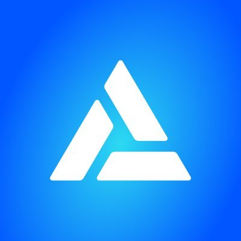
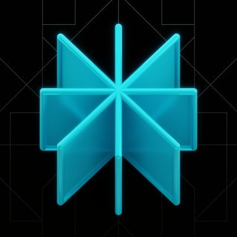
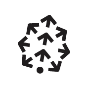
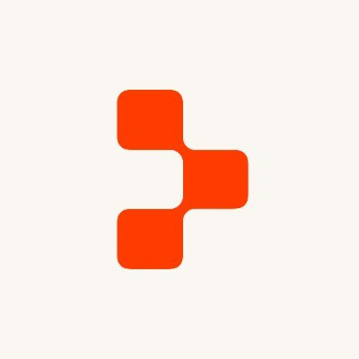
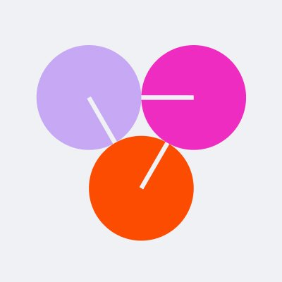

# 🔥 Daily Remote Jobs

  

  <strong><a href="https://www.remotejobscan.com">RemoteJobScan.com</a></strong> &nbsp;·&nbsp; <a href="README.md">📖 中文</a>

  <strong>Real-time remote jobs in AI, Web3, blockchain &amp; crypto.</strong> 
  <strong>Every listing sourced directly from official company websites.</strong>

  📊 <strong>45</strong> companies · <strong>1990</strong> remote jobs · Updated every 30 min

---

## 🆕 Latest Updates（20 featured jobs）

| Position | Location | Details |
|---|---|---|
| QA Engineer (Frontend, Mobile, Java) - Trading | Remote | [View →](https://www.remotejobscan.com/job/11519/qa-engineer-frontend-mobile-java-trading/) |
| Senior Finance Manager / Finance Manager (Treasury Investment Team) | Remote | [View →](https://www.remotejobscan.com/job/11517/senior-finance-manager-finance-manager-treasury-investment-team/) |
| Senior Finance Analyst | On-site | [View →](https://www.remotejobscan.com/job/11516/senior-finance-analyst/) |
| Wealth Products and Structured Products Analyst 理财及结构化产品分析师（校招） | Remote | [View →](https://www.remotejobscan.com/job/11518/wealth-products-and-structured-products-analyst/) |
| Staff Software Engineer, Backend - FinHub (Ledger) | Remote | [View →](https://www.remotejobscan.com/job/11514/staff-software-engineer-backend-finhub-ledger/) |
| Product Support Specialist | On-site | [View →](https://www.remotejobscan.com/job/9541/product-support-specialist/) |
| Product Designer | On-site | [View →](https://www.remotejobscan.com/job/11513/product-designer/) |
| Regional Threat Assessment Manager | Remote | [View →](https://www.remotejobscan.com/job/11426/regional-threat-assessment-manager/) |
| Search and Recommend Algorithm Engineer搜推算法工程师 | Remote | [View →](https://www.remotejobscan.com/job/11359/search-and-recommend-algorithm-engineer/) |
| AI Success Engineer | Hybrid | [View →](https://www.remotejobscan.com/job/11510/ai-success-engineer/) |
| Americas Regional Chief Information Security Officer (CISO) | On-site | [View →](https://www.remotejobscan.com/job/11508/americas-regional-chief-information-security-officer-ciso/) |
| Extended Workforce Program Manager | Hybrid | [View →](https://www.remotejobscan.com/job/11509/extended-workforce-program-manager/) |
| Content Lead | On-site | [View →](https://www.remotejobscan.com/job/11132/content-lead/) |
| Account Director, Retail | Hybrid | [View →](https://www.remotejobscan.com/job/11506/account-director-retail/) |
| Third Party Risk Analyst, Security GRC | Remote | [View →](https://www.remotejobscan.com/job/11505/third-party-risk-analyst-security-grc/) |
| Staff Software Engineer, Core AI Infrastructure | Remote | [View →](https://www.remotejobscan.com/job/9316/staff-software-engineer-core-ai-infrastructure/) |
| Senior Software Engineer, Core AI Infrastructure | Remote | [View →](https://www.remotejobscan.com/job/9272/senior-software-engineer-core-ai-infrastructure/) |
| Manager, IT Support | On-site | [View →](https://www.remotejobscan.com/job/11502/manager-it-support/) |
| GTM Enablement - Global Lead | Remote | [View →](https://www.remotejobscan.com/job/11504/gtm-enablement-global-lead/) |
[📋 Browse all jobs →](https://www.remotejobscan.com)

---

## 🏢 Companies Tracked（45 companies）

| Company | Website | Jobs |
|---|---|---|
|  | <a href="https://1inch.com/">1inch</a> | [View jobs →](https://www.remotejobscan.com/?company=1inch) |
|  | <a href="https://aave.com/">Aave</a> | [View jobs →](https://www.remotejobscan.com/?company=aave) |
|  | <a href="https://www.alchemy.com/">Alchemy</a> | [View jobs →](https://www.remotejobscan.com/?company=alchemy) |
|  | <a href="https://www.anthropic.com/">Anthropic</a> | [View jobs →](https://www.remotejobscan.com/?company=anthropic) |
|  | <a href="https://asterdex.com">Aster</a> | [View jobs →](https://www.remotejobscan.com/?company=aster) |
|  | <a href="https://www.binance.com">Binance</a> | [View jobs →](https://www.remotejobscan.com/?company=binance) |
|  | <a href="https://www.bitget.com/">Bitget</a> | [View jobs →](https://www.remotejobscan.com/?company=bitget) |
|  | <a href="https://www.bnbchain.org">BNB Chain</a> | [View jobs →](https://www.remotejobscan.com/?company=bnb-chain) |
|  | <a href="https://bybitglobal.com/">Bybit</a> | [View jobs →](https://www.remotejobscan.com/?company=bybit) |
|  | <a href="https://www.certik.com/">CertiK</a> | [View jobs →](https://www.remotejobscan.com/?company=certik) |
|  | <a href="https://www.circle.com/">Circle</a> | [View jobs →](https://www.remotejobscan.com/?company=circle) |
|  | <a href="https://cohere.com/">Cohere</a> | [View jobs →](https://www.remotejobscan.com/?company=cohere) |
|  | <a href="https://www.coinbase.com/">Coinbase</a> | [View jobs →](https://www.remotejobscan.com/?company=coinbase) |
|  | <a href="https://www.coinex.com">CoinEx</a> | [View jobs →](https://www.remotejobscan.com/?company=coinex) |
|  | <a href="https://coinmarketcap.com">CoinMarketCap</a> | [View jobs →](https://www.remotejobscan.com/?company=coinmarketcap) |
|  | <a href="https://www.coins.ph">coins.ph</a> | [View jobs →](https://www.remotejobscan.com/?company=coins-ph) |
|  | <a href="https://crypto.com/">crypto.com</a> | [View jobs →](https://www.remotejobscan.com/?company=crypto-com) |
|  | <a href="https://www.digifinex.com">DigiFinex</a> | [View jobs →](https://www.remotejobscan.com/?company=digifinex) |
|  | <a href="https://elevenlabs.io/">ElevenLabs</a> | [View jobs →](https://www.remotejobscan.com/?company=elevenlabs) |
|  | <a href="https://www.gate.com/">Gate</a> | [View jobs →](https://www.remotejobscan.com/?company=gate) |
|  | <a href="https://www.gemini.com/">Gemini</a> | [View jobs →](https://www.remotejobscan.com/?company=gemini) |
|  | <a href="https://hyperfoundation.org/">Hyperliquid</a> | [View jobs →](https://www.remotejobscan.com/?company=hyperliquid) |
|  | <a href="https://www.kraken.com/">Kraken</a> | [View jobs →](https://www.remotejobscan.com/?company=kraken) |
|  | <a href="https://www.kucoin.com/">KuCoin</a> | [View jobs →](https://www.remotejobscan.com/?company=kucoin) |
|  | <a href="https://www.langchain.com/">LangChain</a> | [View jobs →](https://www.remotejobscan.com/?company=langchain) |
|  | <a href="https://layerzero.network">LayerZero</a> | [View jobs →](https://www.remotejobscan.com/?company=layerzero) |
|  | <a href="https://www.lbank.com/">Lbank</a> | [View jobs →](https://www.remotejobscan.com/?company=lbank) |
|  | <a href="https://lista.org">Lista DAO</a> | [View jobs →](https://www.remotejobscan.com/?company=lista-dao) |
|  | <a href="https://www.offchainlabs.com/">OffchainLabs</a> | [View jobs →](https://www.remotejobscan.com/?company=offchainlabs) |
|  | <a href="http://okx.com/">OKX</a> | [View jobs →](https://www.remotejobscan.com/?company=okx) |
|  | <a href="https://www.optimism.io/">OP Labs</a> | [View jobs →](https://www.remotejobscan.com/?company=op-labs) |
|  | <a href="https://openai.com/">OpenAI</a> | [View jobs →](https://www.remotejobscan.com/?company=openai) |
|  | <a href="https://www.paxos.com">PAXOS</a> | [View jobs →](https://www.remotejobscan.com/?company=paxos) |
|  | <a href="https://www.perplexity.ai/">Perplexity</a> | [View jobs →](https://www.remotejobscan.com/?company=perplexity) |
|  | <a href="https://phantom.com/">Phantom</a> | [View jobs →](https://www.remotejobscan.com/?company=phantom) |
|  | <a href="https://www.pinecone.io/">Pinecone</a> | [View jobs →](https://www.remotejobscan.com/?company=pinecone) |
|  | <a href="https://predict.fun">Predict</a> | [View jobs →](https://www.remotejobscan.com/?company=predict) |
|  | <a href="https://replit.com/">Replit</a> | [View jobs →](https://www.remotejobscan.com/?company=replit) |
|  | <a href="https://www.sui.io">Sui</a> | [View jobs →](https://www.remotejobscan.com/?company=sui) |
|  | <a href="https://www.together.ai/">Together AI</a> | [View jobs →](https://www.remotejobscan.com/?company=together-ai) |
|  | <a href="https://tothemoon.com/">Tothemoon</a> | [View jobs →](https://www.remotejobscan.com/?company=tothemoon) |
|  | <a href="https://tron.network">TRON</a> | [View jobs →](https://www.remotejobscan.com/?company=tron) |
|  | <a href="https://trustwallet.com">Trust Wallet</a> | [View jobs →](https://www.remotejobscan.com/?company=trust-wallet) |
|  | <a href="https://u.tech">United Stables</a> | [View jobs →](https://www.remotejobscan.com/?company=united-stables) |
|  | <a href="https://vercel.com/">Vercel</a> | [View jobs →](https://www.remotejobscan.com/?company=vercel) |

---

---

  Maintained by <a href="https://www.remotejobscan.com">RemoteJobScan</a> · 2026-07-23 09:00 UTC 
  ⭐ Star this repo if you find it useful

