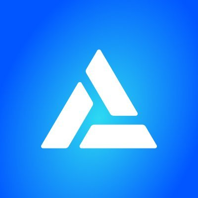
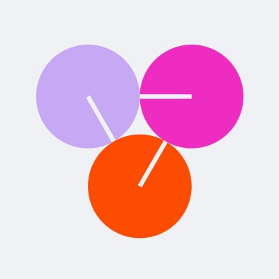
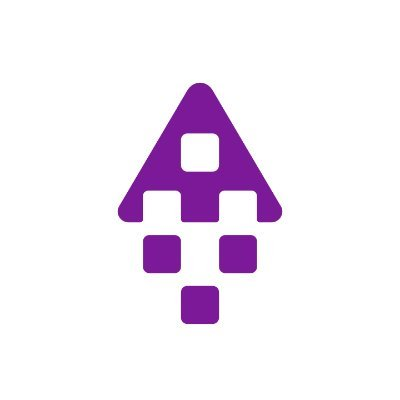
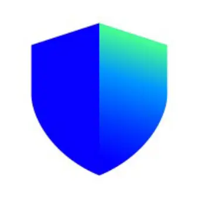

# 🔥 Daily Remote Jobs

  

  <strong><a href="https://www.remotejobscan.com">RemoteJobScan.com</a></strong> &nbsp;·&nbsp; <a href="README.md">📖 中文</a>

  <strong>Real-time remote jobs in AI, Web3, blockchain &amp; crypto.</strong> 
  <strong>Every listing sourced directly from official company websites.</strong>

  📊 <strong>48</strong> companies · <strong>2334</strong> remote jobs · Updated every 30 min

---

## 🆕 Latest Updates（20 featured jobs）

| Position | Location | Details |
|---|---|---|
| Institutional Business Development Manager（Europe） | Remote | [View →](https://www.remotejobscan.com/job/7303/institutional-business-development-managereurope/) |
| Liquidity Operations Specialist 流动性运营 | Remote | [View →](https://www.remotejobscan.com/job/12038/liquidity-operations-specialist/) |
| Senior Strategic Program Lead | Remote | [View →](https://www.remotejobscan.com/job/9300/senior-strategic-program-lead/) |
| Data BP 数据BP （出海香港） | Remote | [View →](https://www.remotejobscan.com/job/8912/data-bp-bp/) |
| Technical Program Manager, GFCO Analytics | Remote | [View →](https://www.remotejobscan.com/job/9333/technical-program-manager-gfco-analytics/) |
| Live Streaming Growth Operations(Part-time) 直播增长运营（兼职） | Remote | [View →](https://www.remotejobscan.com/job/8937/live-streaming-growth-operationspart-time/) |
| Senior Manager Product Operations, FCM Ops | Remote | [View →](https://www.remotejobscan.com/job/12089/senior-manager-product-operations-fcm-ops/) |
| Compliance Analyst | On-site | [View →](https://www.remotejobscan.com/job/12088/compliance-analyst/) |
| Support Vendor Manager | Hybrid | [View →](https://www.remotejobscan.com/job/12087/support-vendor-manager/) |
| Senior Product Manager - Predictions, OG | Hybrid | [View →](https://www.remotejobscan.com/job/12086/senior-product-manager-predictions-og/) |
| Senior Architect of the Securities Trading System 证券交易系统资深架构师 | Remote | [View →](https://www.remotejobscan.com/job/12085/senior-architect-of-the-securities-trading-system/) |
| VIP BD | Remote | [View →](https://www.remotejobscan.com/job/8475/vip-bd/) |
| Customer Education, Content & Systems Operations Lead | On-site | [View →](https://www.remotejobscan.com/job/10461/customer-education-content-systems-operations-lead/) |
| Insider Risk Investigator | On-site | [View →](https://www.remotejobscan.com/job/12084/insider-risk-investigator/) |
| Incident & Crisis Management Lead | On-site | [View →](https://www.remotejobscan.com/job/12083/incident-crisis-management-lead/) |
| Senior Software Engineer - AI Platform Team | Remote | [View →](https://www.remotejobscan.com/job/12080/senior-software-engineer-ai-platform-team/) |
| Senior Program Manager, Corporate Affairs | Hybrid | [View →](https://www.remotejobscan.com/job/12082/senior-program-manager-corporate-affairs/) |
| Contract Management Lead (Procurement) | Hybrid | [View →](https://www.remotejobscan.com/job/12081/contract-management-lead-procurement/) |
| Forward Deployed Engineer (FDE), Healthcare - NYC | Hybrid | [View →](https://www.remotejobscan.com/job/12078/forward-deployed-engineer-fde-healthcare-nyc/) |
| Forward Deployed Engineer (FDE), Healthcare - Seattle | Hybrid | [View →](https://www.remotejobscan.com/job/12077/forward-deployed-engineer-fde-healthcare-seattle/) |
[📋 Browse all jobs →](https://www.remotejobscan.com)

---

## 🏢 Companies Tracked（48 companies）

| Company | Website | Jobs |
|---|---|---|
|  | <a href="https://1inch.com/">1inch</a> | [View jobs →](https://www.remotejobscan.com/?company=1inch) |
|  | <a href="https://aave.com/">Aave</a> | [View jobs →](https://www.remotejobscan.com/?company=aave) |
|  | <a href="https://www.alchemy.com/">Alchemy</a> | [View jobs →](https://www.remotejobscan.com/?company=alchemy) |
|  | <a href="https://www.anthropic.com/">Anthropic</a> | [View jobs →](https://www.remotejobscan.com/?company=anthropic) |
|  | <a href="https://aptoslabs.com/">Aptos Labs</a> | [View jobs →](https://www.remotejobscan.com/?company=aptos-labs) |
|  | <a href="https://asterdex.com">Aster</a> | [View jobs →](https://www.remotejobscan.com/?company=aster) |
|  | <a href="https://www.binance.com">Binance</a> | [View jobs →](https://www.remotejobscan.com/?company=binance) |
|  | <a href="https://www.bitget.com/">Bitget</a> | [View jobs →](https://www.remotejobscan.com/?company=bitget) |
|  | <a href="https://www.bnbchain.org">BNB Chain</a> | [View jobs →](https://www.remotejobscan.com/?company=bnb-chain) |
|  | <a href="https://bybitglobal.com/">Bybit</a> | [View jobs →](https://www.remotejobscan.com/?company=bybit) |
|  | <a href="https://www.certik.com/">CertiK</a> | [View jobs →](https://www.remotejobscan.com/?company=certik) |
|  | <a href="https://www.circle.com/">Circle</a> | [View jobs →](https://www.remotejobscan.com/?company=circle) |
|  | <a href="https://cohere.com/">Cohere</a> | [View jobs →](https://www.remotejobscan.com/?company=cohere) |
|  | <a href="https://www.coinbase.com/">Coinbase</a> | [View jobs →](https://www.remotejobscan.com/?company=coinbase) |
|  | <a href="https://www.coinex.com">CoinEx</a> | [View jobs →](https://www.remotejobscan.com/?company=coinex) |
|  | <a href="https://coinmarketcap.com">CoinMarketCap</a> | [View jobs →](https://www.remotejobscan.com/?company=coinmarketcap) |
|  | <a href="https://www.coins.ph">coins.ph</a> | [View jobs →](https://www.remotejobscan.com/?company=coins-ph) |
|  | <a href="https://crypto.com/">crypto.com</a> | [View jobs →](https://www.remotejobscan.com/?company=crypto-com) |
|  | <a href="https://www.digifinex.com">DigiFinex</a> | [View jobs →](https://www.remotejobscan.com/?company=digifinex) |
|  | <a href="https://elevenlabs.io/">ElevenLabs</a> | [View jobs →](https://www.remotejobscan.com/?company=elevenlabs) |
|  | <a href="https://www.gate.com/">Gate</a> | [View jobs →](https://www.remotejobscan.com/?company=gate) |
|  | <a href="https://www.gauntlet.xyz/">Gauntlet</a> | [View jobs →](https://www.remotejobscan.com/?company=gauntlet) |
|  | <a href="https://www.gemini.com/">Gemini</a> | [View jobs →](https://www.remotejobscan.com/?company=gemini) |
|  | <a href="https://hyperfoundation.org/">Hyperliquid</a> | [View jobs →](https://www.remotejobscan.com/?company=hyperliquid) |
|  | <a href="https://www.kraken.com/">Kraken</a> | [View jobs →](https://www.remotejobscan.com/?company=kraken) |
|  | <a href="https://www.kucoin.com/">KuCoin</a> | [View jobs →](https://www.remotejobscan.com/?company=kucoin) |
|  | <a href="https://www.langchain.com/">LangChain</a> | [View jobs →](https://www.remotejobscan.com/?company=langchain) |
|  | <a href="https://layerzero.network">LayerZero</a> | [View jobs →](https://www.remotejobscan.com/?company=layerzero) |
|  | <a href="https://www.lbank.com/">Lbank</a> | [View jobs →](https://www.remotejobscan.com/?company=lbank) |
|  | <a href="https://lista.org">Lista DAO</a> | [View jobs →](https://www.remotejobscan.com/?company=lista-dao) |
|  | <a href="https://www.offchainlabs.com/">OffchainLabs</a> | [View jobs →](https://www.remotejobscan.com/?company=offchainlabs) |
|  | <a href="http://okx.com/">OKX</a> | [View jobs →](https://www.remotejobscan.com/?company=okx) |
|  | <a href="https://www.optimism.io/">OP Labs</a> | [View jobs →](https://www.remotejobscan.com/?company=op-labs) |
|  | <a href="https://openai.com/">OpenAI</a> | [View jobs →](https://www.remotejobscan.com/?company=openai) |
|  | <a href="https://www.paxos.com">PAXOS</a> | [View jobs →](https://www.remotejobscan.com/?company=paxos) |
|  | <a href="https://www.perplexity.ai/">Perplexity</a> | [View jobs →](https://www.remotejobscan.com/?company=perplexity) |
|  | <a href="https://phantom.com/">Phantom</a> | [View jobs →](https://www.remotejobscan.com/?company=phantom) |
|  | <a href="https://www.pinecone.io/">Pinecone</a> | [View jobs →](https://www.remotejobscan.com/?company=pinecone) |
|  | <a href="https://predict.fun">Predict</a> | [View jobs →](https://www.remotejobscan.com/?company=predict) |
|  | <a href="https://replit.com/">Replit</a> | [View jobs →](https://www.remotejobscan.com/?company=replit) |
|  | <a href="https://solana.org/">Solana Foundation</a> | [View jobs →](https://www.remotejobscan.com/?company=solana-foundation) |
|  | <a href="https://www.sui.io">Sui</a> | [View jobs →](https://www.remotejobscan.com/?company=sui) |
|  | <a href="https://www.together.ai/">Together AI</a> | [View jobs →](https://www.remotejobscan.com/?company=together-ai) |
|  | <a href="https://tothemoon.com/">Tothemoon</a> | [View jobs →](https://www.remotejobscan.com/?company=tothemoon) |
|  | <a href="https://tron.network">TRON</a> | [View jobs →](https://www.remotejobscan.com/?company=tron) |
|  | <a href="https://trustwallet.com">Trust Wallet</a> | [View jobs →](https://www.remotejobscan.com/?company=trust-wallet) |
|  | <a href="https://u.tech">United Stables</a> | [View jobs →](https://www.remotejobscan.com/?company=united-stables) |
|  | <a href="https://vercel.com/">Vercel</a> | [View jobs →](https://www.remotejobscan.com/?company=vercel) |

---

---

  Maintained by <a href="https://www.remotejobscan.com">RemoteJobScan</a> · 2026-08-06 10:00 UTC 
  ⭐ Star this repo if you find it useful

